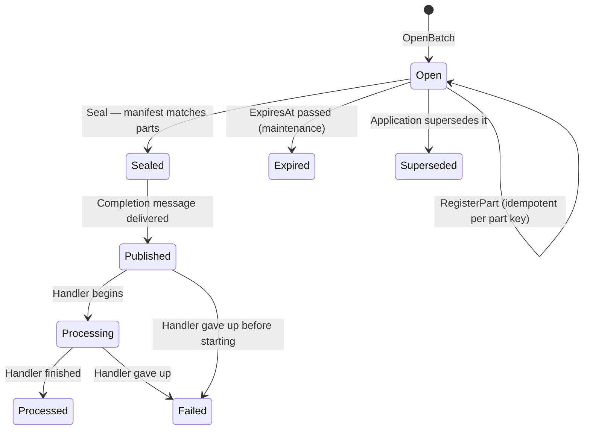
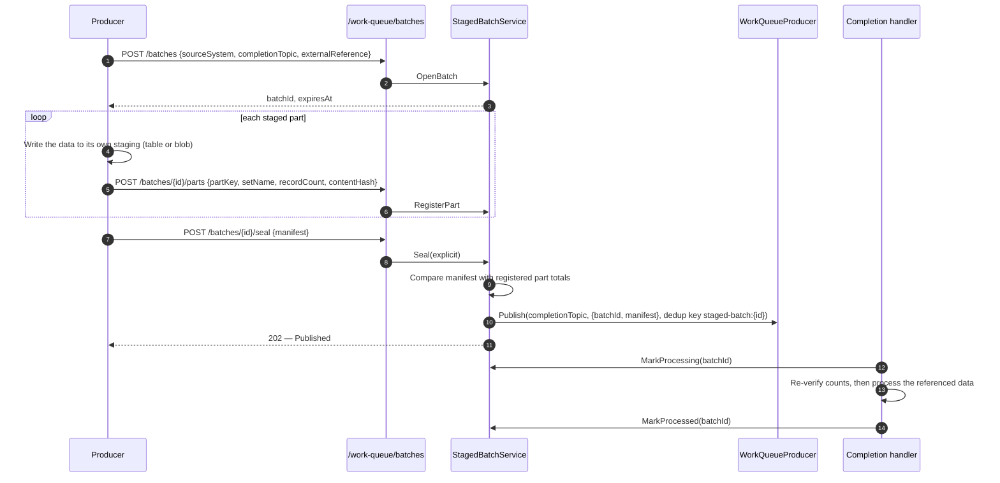
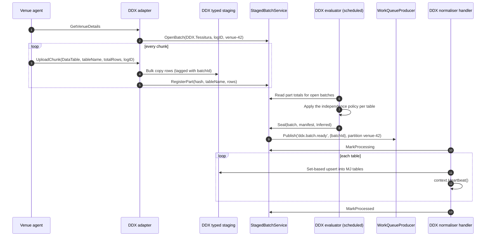

# Path C — Staged Batch Ingestion (Parked)

**Status:** Parked. **Not reviewed, not approved, not scheduled.**
**Date parked:** 2026-09-15

This material was drafted while the work queue was being designed around a DDX ingestion use case,
then deliberately removed from Phase 1. The use case that motivated it is not fully thought through,
and it is not yet established that a framework-level staging and sealing layer is needed at all.

It is kept verbatim so a later sketch pass can start from it rather than from nothing. Treat every
statement below as a draft to be challenged. Nothing in Phase 1 depends on it.

**Why it is separable.** Staged batches would consume only `WorkQueueProducer.Publish` and would own
their own tables, REST endpoints, scope (`workqueue:ingest`), maintenance tasks and integration bundle.
The work queue has no knowledge of batches, so adding this later is purely additive.

**Questions to answer before reviving it**

1. Is "complete enough to process" a framework concern, or always an application concern?
2. Would applications be better served by publishing a reference to data they staged themselves?
3. Does any producer other than a legacy push agent need a seal protocol?
4. If blob-backed parts are needed, which storage provider owns the data and its deletion?

---

## 1. Design draft (formerly design §9 and §11)

### 9. Staged batches





Two details make this robust:

- **Seal then publish is recoverable.** The seal is a guarded status change; the publish carries the
  deduplication key `staged-batch:{id}`. If the process dies between the two, maintenance republishes
  any batch left `Sealed`, and the key drops the repeat.
- **Handlers re-verify.** A part can in principle be registered between manifest verification and
  the seal write. The handler compares the manifest with what it actually reads before processing.

### 11. Use case 2 — Staged ingestion from a legacy push agent (DDX)

**Context.** About 140 Tessitura venues run an on-premise agent that pushes box-office extracts to a
fixed SOAP endpoint. Each upload is a 1,000-row chunk tagged with a table name, the table's total row
count and a session log ID. The agent never says "done". The agent and its wire format cannot be
changed without visiting client sites. (Background: TRG design notes in the `mj-trg` repository,
`purple7/design/`.)

The DDX service becomes a thin adapter onto staged batches:

| DDX protocol | Staged batch call |
| --- | --- |
| `GetVenueDetails` (session starts, log ID issued) | `OpenBatch` — `SourceSystem = 'DDX.Tessitura'`, `ExternalReference = logID`, `PartitionKey = 'venue-{id}'` |
| `UploadChunk` | write rows to the DDX application's typed staging, then `RegisterPart` — `PartKey = SHA-256 of the chunk`, `SetName = tableName`, `RecordCount = rows` |
| *(no end signal)* | the DDX application's evaluator calls `Seal` with `SealMode = Inferred` |

Using the content hash as the part key means a chunk the agent resends after a timeout registers once.



**The independence policy is DDX application logic, not framework logic.** For a table that can be
processed chunk by chunk, the evaluator publishes its own messages (partition `venue-42:Customer`, or
none, with newer-wins upserts). For full-extract tables it waits for the whole load and seals.
The framework only provides the primitives: batches, parts, seal, publish, partitioned queues.

Timeouts are also application logic: the evaluator supersedes or expires a batch whose session went
quiet past the venue's `ddxTimeout`. The framework's own expiry (`ExpiresAt`) is the backstop.

Rewritten pull integrations (Spektrix, Ticketsolve, PatronManager) use the same batches with an
**explicit** seal, because they know when they are done.

---

## 2. Schema draft (formerly interfaces §3.6–3.7)

#### 3.6 `StagedBatch`

| Column | Type | Null | Default | Rule |
| --- | --- | --- | --- | --- |
| `ID` | `UNIQUEIDENTIFIER` | no | `NEWSEQUENTIALID()` | primary key |
| `SourceSystem` | `NVARCHAR(100)` | no | | |
| `ExternalReference` | `NVARCHAR(200)` | yes | | unique with `SourceSystem` when not null (`UQ_StagedBatch_External`) |
| `PartitionKey` | `NVARCHAR(200)` | yes | | used for the completion publish |
| `TenantID` | `NVARCHAR(100)` | yes | | |
| `CompletionTopicID` | `UNIQUEIDENTIFIER` | no | | FK `WorkQueueTopic.ID` |
| `Status` | `NVARCHAR(20)` | no | `'Open'` | `'Open'`, `'Sealed'`, `'Published'`, `'Processing'`, `'Processed'`, `'Failed'`, `'Expired'`, `'Superseded'` |
| `SealMode` | `NVARCHAR(10)` | yes | | `'Explicit'`, `'Inferred'` |
| `Manifest` | `NVARCHAR(MAX)` | yes | | JSON, see §6 |
| `ExpiresAt` | `DATETIMEOFFSET` | no | | |
| `SealedAt` | `DATETIMEOFFSET` | yes | | |
| `PublishedAt` | `DATETIMEOFFSET` | yes | | |
| `ProcessedAt` | `DATETIMEOFFSET` | yes | | |
| `FailureReason` | `NVARCHAR(MAX)` | yes | | |

Index `IX_StagedBatch_Status_ExpiresAt` on `(Status, ExpiresAt)`.

#### 3.7 `StagedBatchPart`

| Column | Type | Null | Default | Rule |
| --- | --- | --- | --- | --- |
| `ID` | `UNIQUEIDENTIFIER` | no | `NEWSEQUENTIALID()` | primary key |
| `BatchID` | `UNIQUEIDENTIFIER` | no | | FK `StagedBatch.ID` |
| `PartKey` | `NVARCHAR(200)` | no | | unique with `BatchID` (`UQ_StagedBatchPart_Batch_PartKey`) |
| `SetName` | `NVARCHAR(200)` | no | | |
| `RecordCount` | `INT` | no | | `>= 0` |
| `ContentHash` | `NVARCHAR(64)` | yes | | SHA-256 hex |
| `StorageLocation` | `NVARCHAR(1000)` | yes | | claim-check pointer |

---

## 3. Contract draft (formerly interfaces §6)

### 6. Staged batch contracts

```typescript
export type StagedBatchStatus = 'Open' | 'Sealed' | 'Published' | 'Processing' | 'Processed' | 'Failed' | 'Expired' | 'Superseded';
export type SealMode = 'Explicit' | 'Inferred';

export interface StagedBatchManifestSet { name: string; expectedRecords: number; }
export interface StagedBatchManifest { sets: StagedBatchManifestSet[]; }

export interface OpenBatchRequest {
    SourceSystem: string;
    CompletionTopicName: string;
    ExternalReference?: string;
    PartitionKey?: string;
    TenantID?: string;
    ExpiresInSeconds?: number;
}

export interface RegisterPartRequest {
    PartKey: string;
    SetName: string;
    RecordCount: number;
    ContentHash?: string;
    StorageLocation?: string;
}

export interface StagedBatchSummary {
    ID: string;
    SourceSystem: string;
    ExternalReference: string | null;
    PartitionKey: string | null;
    TenantID: string | null;
    CompletionTopicID: string;
    Status: StagedBatchStatus;
    SealMode: SealMode | null;
    ExpiresAt: Date;
}

export interface PartTotal { SetName: string; Records: number; }
export interface ManifestMismatch { SetName: string; ExpectedRecords: number | null; ActualRecords: number | null; }

export type RegisterPartResult =
    | { Kind: 'Registered' }
    | { Kind: 'Duplicate' }
    | { Kind: 'BatchNotOpen'; Status: StagedBatchStatus | null };

export type SealResult =
    | { Kind: 'Published'; PublishID: string }
    | { Kind: 'ManifestMismatch'; Mismatches: ManifestMismatch[] }
    | { Kind: 'BatchNotOpen'; Status: StagedBatchStatus | null };

/** Payload published to a batch's completion topic. */
export interface StagedBatchReadyMessage {
    batchId: string;
    sourceSystem: string;
    externalReference: string | null;
    tenantId: string | null;
    sealMode: SealMode;
    manifest: StagedBatchManifest;
}

export class StagedBatchService {
    public OpenBatch(request: OpenBatchRequest, contextUser: UserInfo): Promise<StagedBatchSummary>;
    public GetBatch(batchID: string, contextUser: UserInfo): Promise<StagedBatchSummary | null>;
    public RegisterPart(batchID: string, request: RegisterPartRequest, contextUser: UserInfo): Promise<RegisterPartResult>;
    public Seal(batchID: string, manifest: StagedBatchManifest, sealMode: SealMode, contextUser: UserInfo): Promise<SealResult>;
    public PublishSealed(batchID: string, contextUser: UserInfo): Promise<string | null>;
    public MarkProcessing(batchID: string, contextUser: UserInfo): Promise<boolean>;
    public MarkProcessed(batchID: string, contextUser: UserInfo): Promise<boolean>;
    public MarkFailed(batchID: string, reason: string, contextUser: UserInfo): Promise<boolean>;
    public Supersede(batchID: string, contextUser: UserInfo): Promise<boolean>;
}
```

Status transitions accepted by the guarded writes:

| Method | From | To |
| --- | --- | --- |
| `Seal` | `Open` | `Sealed` |
| `PublishSealed` | `Sealed` | `Published` |
| `MarkProcessing` | `Published`, `Failed` | `Processing` |
| `MarkProcessed` | `Processing` | `Processed` |
| `MarkFailed` | `Published`, `Processing` | `Failed` |
| `Supersede` | `Open`, `Sealed` | `Superseded` |
| maintenance expiry | `Open` past `ExpiresAt` | `Expired` |

---

## 4. REST draft (formerly interfaces §7)

| Method and path | Scope | Body | Success | Errors |
| --- | --- | --- | --- | --- |
| `POST /work-queue/batches` | `workqueue:ingest` | `{ sourceSystem, completionTopic, externalReference?, partitionKey?, tenantId?, expiresInSeconds? }` | `201` batch summary | `400` · `403` completion topic not externally publishable · `404` unknown topic |
| `GET /work-queue/batches/:batchId` | `workqueue:ingest` | — | `200` batch summary | `404` |
| `POST /work-queue/batches/:batchId/parts` | `workqueue:ingest` | `{ partKey, setName, recordCount, contentHash?, storageLocation? }` | `201 { registered: true, duplicate: false }` or `200 { registered: false, duplicate: true }` | `400` · `409 { error, status }` batch not open |
| `POST /work-queue/batches/:batchId/seal` | `workqueue:ingest` | `{ manifest: { sets: [{ name, expectedRecords }] } }` | `202 { status: 'Published', publishId }` | `400` · `409 { error, mismatches }` · `409 { error, status }` batch not open |

Batch summary JSON: `{ batchId, sourceSystem, externalReference, partitionKey, tenantId, status, sealMode, expiresAt }`.
REST-opened batches are always sealed `Explicit`.
