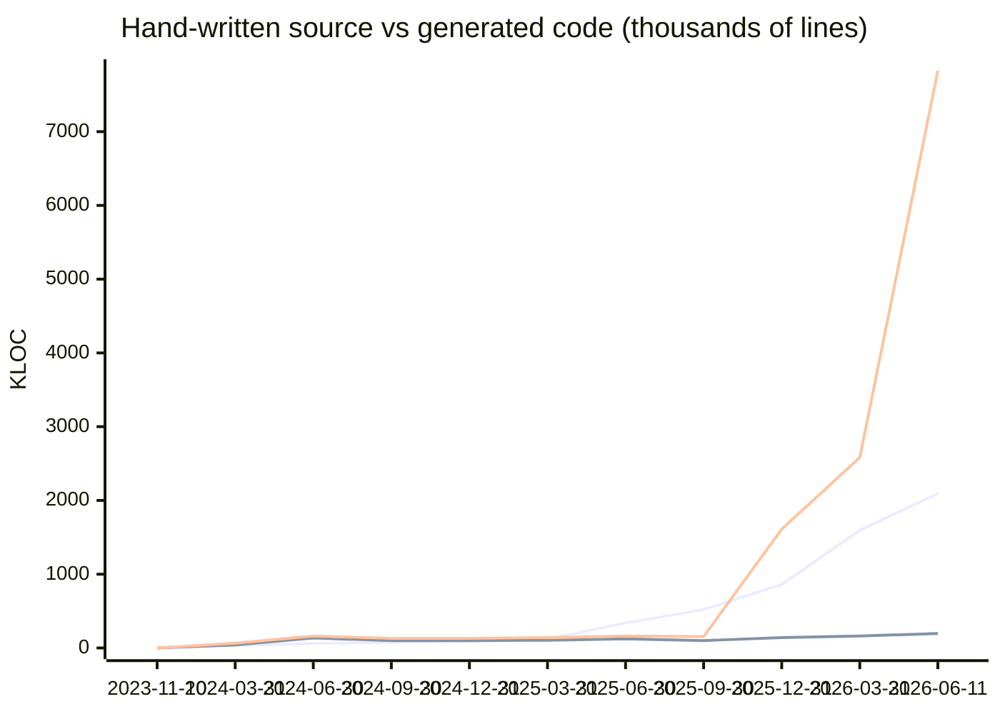
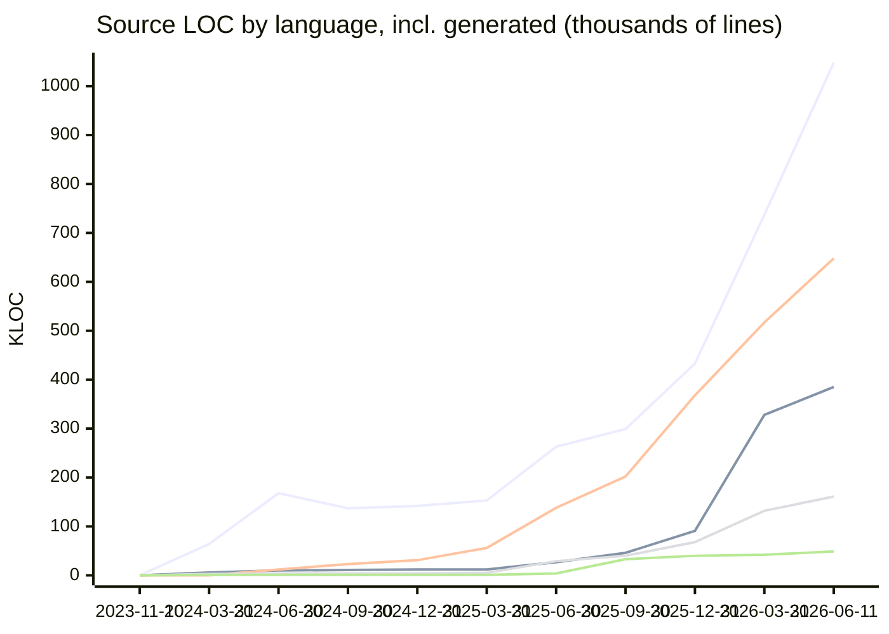
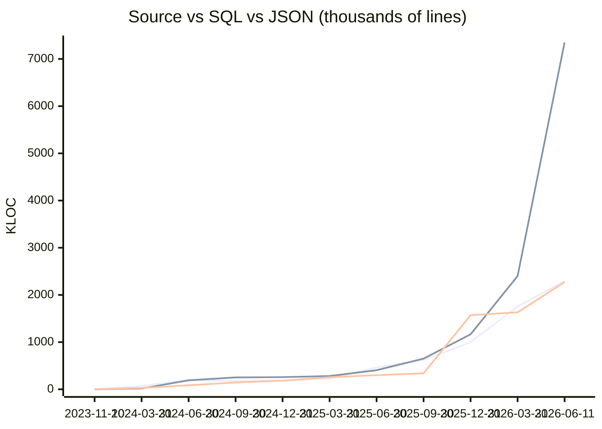

# Repository Stats

Lines-of-code snapshots over time, counted with [cloc](https://github.com/AlDanial/cloc) over git-tracked files
(`node_modules`, `dist`, and other ignored paths are excluded automatically). Every count is split into
**hand-written** vs **generated** — deterministic tool output such as CodeGen entity classes/forms/resolvers,
`mj codegen manifest` registrations, mj-sync metadata migrations, baseline consolidations, pg-migrate
conversions, connector metadata, and lockfiles. The exact patterns live in [repo-stats.mjs](repo-stats.mjs).

To record a new snapshot (or use the `/update-stats` Claude command, which adds narrative analysis):

```bash
node stats/repo-stats.mjs              # current tree
node stats/repo-stats.mjs <commit>     # backfill a historical commit
node stats/repo-stats.mjs --render     # re-render README from data.csv (no recount)
```

**Latest** (2026-06-11, `ade23a0282`): **2,094,406** hand-written source LOC · 2,290,578 source incl. generated · **11,935,925** total LOC (66% generated) · 13,760 files

## Latest analysis (2026-06-11)

Hand-written source code (TypeScript, JavaScript, HTML, CSS, Markdown) grew by roughly 499,000 lines since the 2026-03-31 snapshot, a solid 31% jump driven by a concentrated burst of feature work rather than any single headline addition. TypeScript alone added 289K hand-written lines, HTML 46K, CSS 29K, and Markdown 130K — the Markdown growth reflecting a wave of guides, CLAUDE.md files, and package READMEs that the team has been disciplined about keeping current. The largest feature areas visible in the git log are the AI agent session infrastructure (PRs #2787, #2823), the integration framework expansion (#2752), the colocated vector search (#2720), the Auth0 magic-link feature (#2726), the Knowledge Hub classify redesign (#2737), and the real-time voice co-agent work (the active `an-dev-26`/`an-dev-27` branch series). Several security and correctness fixes also landed — XSS mitigation for entity communication (#2782), a RunView cache-miss fields-projection fix (#2814), agent run watchdog (#2744), and a scheduled-job poll/execution decoupling (#2750).

The raw line-count headline is dominated by SQL, which added nearly 5 million lines — but 4.69M of those are machine-emitted. The migration split breaks down as follows: the `migrations-pg` directory (PostgreSQL mirror conversions) accounts for roughly 2.43M net insertions across 179 files, while the `migrations` directory contributed another 3.03M net insertions across 94 files. Within the `migrations` tree, the bulk is a PostgreSQL baseline consolidation (`CB-baseline-pg-migration`, PR #2794) that landed as a family of `B*__*.sql` files — large snapshot-in-time baselines that the repo now tracks so downstream PostgreSQL deployments can onboard without replaying every historical migration. The remainder of the SQL growth is the normal cadence of CodeGen-run files and mj-sync metadata-export migrations that accumulate with each release cycle (v5.38 through v5.40.x shipped in this window).

JSON grew by 642K lines total, of which 520K is generated — overwhelmingly the integration-actions metadata that the `generate-integration-actions` tooling emits for connectors, plus the package-lock.json churn from new dependencies. The 122K hand-written JSON lines represent new metadata seed files, schema definitions, and application configuration added as the metadata-sync workflow continues to replace SQL INSERT statements for reference-data seeding.

This is the first snapshot that separates hand-written from generated code, and the ratio is striking: 66% of all tracked lines (7.83M of 11.94M) are deterministic tool output. Within "source" languages — TypeScript, HTML, CSS, JavaScript, Markdown — the generated fraction is only 9%, meaning the human-authored surface of the product is well under control. The high overall generated percentage is almost entirely the SQL migration corpus. That ratio will grow further as PostgreSQL parity work matures and each new migration cycle adds another set of CodeGen-run and pg-mirror files; it is a sign of a healthy automation pipeline rather than a problem, but worth watching so the baselines are periodically consolidated rather than left to accumulate unbounded.

## Hand-written vs generated over time

Lines in top-to-bottom legend order: **hand-written source (TS+JS+HTML+CSS+MD), generated source, all generated code (every language)**.



## Source code over time

Lines in top-to-bottom legend order: **TypeScript, HTML, Markdown, CSS, JavaScript** (totals incl. generated).



## Source vs generated/data over time

Lines: **Source total (TS+JS+HTML+CSS+MD), SQL, JSON**. SQL is dominated by tool-emitted migrations;
JSON is mostly declarative metadata and committed tool outputs.



## History

Per-language cells show total LOC with the generated share in parentheses. **Hand Source** = source LOC minus generated.

| Date | Commit | TypeScript | JavaScript | HTML | CSS | Markdown | Hand Source | SQL | JSON | Grand Total | Files |
|---|---|---:|---:|---:|---:|---:|---:|---:|---:|---:|---:|
| [2023-11-10](reports/2023-11-10.md) · [analysis](analysis/2023-11-10.md) | `ded939260c` | 0 | 0 | 1 | 0 | 27 | **28** | 0 | 0 | 28 | 2 |
| [2024-03-31](reports/2024-03-31.md) · [analysis](analysis/2024-03-31.md) | `ddd43bf190` | 64,038 (57%) | 533 | 5,753 (52%) | 3,156 | 334 | **34,294** | 16,647 | 28,835 (87%) | 127,721 | 928 |
| [2024-06-30](reports/2024-06-30.md) · [analysis](analysis/2024-06-30.md) | `008aed0251` | 167,864 (76%) | 658 | 10,397 (65%) | 4,179 | 11,593 | **59,565** | 190,984 | 86,111 (32%) | 472,696 | 1,475 |
| [2024-09-30](reports/2024-09-30.md) · [analysis](analysis/2024-09-30.md) | `a5290aaeeb` | 137,332 (67%) | 748 | 11,472 (68%) | 4,185 | 22,586 | **77,139** | 253,193 | 144,755 (22%) | 575,184 | 1,662 |
| [2024-12-31](reports/2024-12-31.md) · [analysis](analysis/2024-12-31.md) | `681e361c18` | 142,226 (65%) | 1,385 | 11,738 (64%) | 4,438 | 30,624 | **90,587** | 257,685 | 183,280 (17%) | 632,456 | 1,772 |
| [2025-03-31](reports/2025-03-31.md) · [analysis](analysis/2025-03-31.md) | `2bfb39a6b3` | 152,757 (64%) | 1,386 | 12,270 (64%) | 4,596 | 55,668 | **121,284** | 282,370 | 256,894 (14%) | 767,094 | 1,883 |
| [2025-06-30](reports/2025-06-30.md) · [analysis](analysis/2025-06-30.md) | `adee85788a` | 263,127 (43%) | 3,537 | 26,876 (34%) | 28,782 (1%) | 138,488 | **338,096** | 404,760 | 299,354 (13%) | 1,166,140 | 2,826 |
| [2025-09-30](reports/2025-09-30.md) · [analysis](analysis/2025-09-30.md) | `3f71ef40a9` | 299,077 (30%) | 32,899 | 46,359 (18%) | 39,997 (1%) | 202,466 | **521,292** | 649,918 | 339,735 (16%) | 1,611,869 | 3,541 |
| [2025-12-31](reports/2025-12-31.md) · [analysis](analysis/2025-12-31.md) | `fc0d67833f` | 432,542 (19%) | 40,442 | 91,124 (45%) | 67,869 | 367,894 (4%) | **860,252** | 1,165,550 (22%) | 1,572,071 (77%) | 3,739,626 | 5,214 |
| [2026-03-31](reports/2026-03-31.md) · [analysis](analysis/2026-03-31.md) | `ada6e1a5d1` | 737,301 (14%) | 42,256 | 327,894 (15%) | 132,178 | 517,314 (3%) | **1,594,996** | 2,399,109 (49%) | 1,630,992 (76%) | 5,801,931 | 7,772 |
| [2026-06-11](reports/2026-06-11.md) · [analysis](analysis/2026-06-11.md) | `ade23a0282` | 1,048,378 (12%) | 48,944 | 384,574 (15%) | 161,048 | 647,634 (2%) | **2,094,406** | 7,351,084 (80%) | 2,273,191 (78%) | 11,935,925 | 13,760 |

Full per-language breakdowns and snapshot-over-snapshot deltas are in [reports/](reports/);
narrative analyses in [analysis/](analysis/). Raw time series: [data.csv](data.csv).
