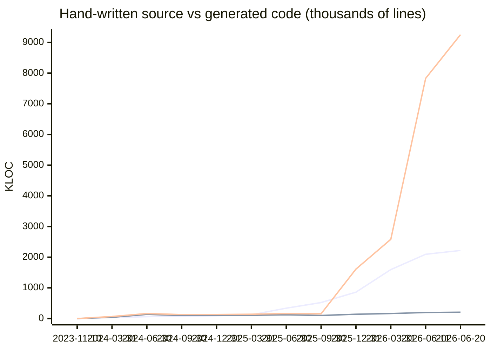
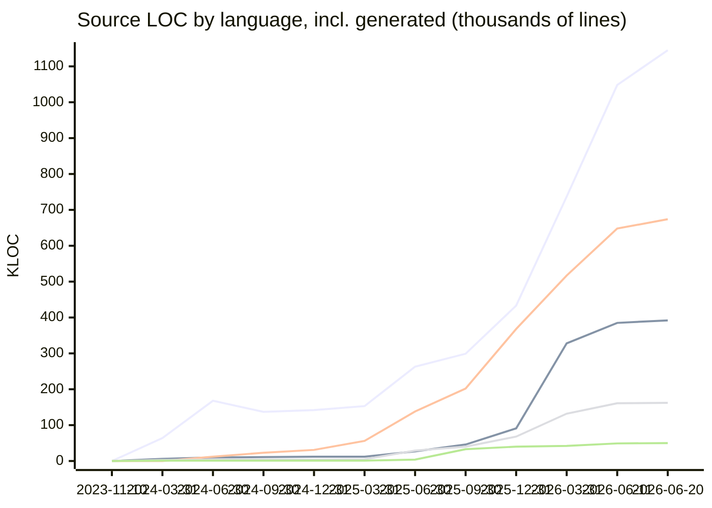
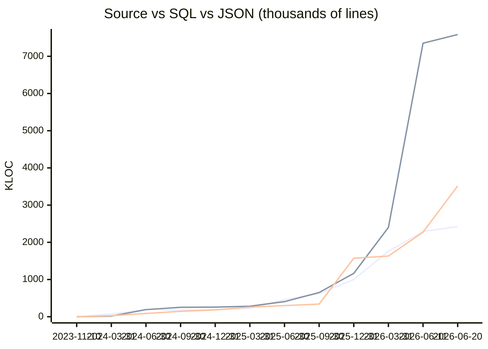

# Repository Stats

Lines-of-code snapshots over time, counted with [cloc](https://github.com/AlDanial/cloc) over git-tracked files
(`node_modules`, `dist`, and other ignored paths are excluded automatically). Every count is split into
**hand-written** vs **generated** — deterministic tool output such as CodeGen entity classes/forms/resolvers,
`mj codegen manifest` registrations, mj-sync metadata migrations, baseline consolidations, pg-migrate
conversions, connector metadata, and lockfiles. The exact patterns live in [repo-stats.mjs](repo-stats.mjs).

To record a new snapshot (or use the `/update-stats` Claude command, which adds narrative analysis):

```bash
node stats/repo-stats.mjs              # current tree
node stats/repo-stats.mjs <commit>     # backfill a historical commit
node stats/repo-stats.mjs --render     # re-render README from data.csv (no recount)
```

**Latest** (2026-06-20, `77f7a12456`): **2,218,083** hand-written source LOC · 2,423,361 source incl. generated · **13,546,105** total LOC (68% generated) · 14,646 files

## Latest analysis (2026-06-20)

This is a short, nine-day snapshot rather than a quarterly one, so the deltas are smaller and more concentrated than usual. Hand-written source code (TypeScript, JavaScript, HTML, CSS, Markdown) grew by roughly 124,000 lines, almost three-quarters of it TypeScript (+90.5K hand-written). The single largest feature area is the unified integration-connector framework (PRs #2832 connectors/integration-v2-unified, #2888 sharepoint-dynamics, #2891 integration-deploy-fix): `packages/Integration/connectors/src` added ~11K lines of source plus ~8.9K of tests, with another ~3.6K in the integration engine. Realtime work continued to land as well — the RealtimeBridge server native-SDK bindings (#2877), the realtime/remote-browser conversation UI, and the whiteboard component — together accounting for most of the remaining TypeScript and the +4.2K hand-written HTML / +1.4K CSS. Markdown added 26K lines, the usual steady cadence of guides, CLAUDE.md files, and package READMEs.

The raw line-count headline is again dominated by tool output. JSON jumped +1.24M lines, of which +1.23M is generated — and this is almost entirely connector action metadata under `metadata/integrations/**`. Two files alone drive it: the Salesforce integration metadata (+829K lines) and Microsoft Dynamics 365 (+346K), with iMIS, Cvent, Hivebrite, Path LMS, NetSuite, Fonteva, and Neon CRM each adding tens of thousands more. This is the `generate-integration-actions` tooling emitting the full action surface for the v2 connector rollout, and it is correctly classified as generated.

SQL grew +235K (+184K generated), driven by the PostgreSQL split-and-regenerate pipeline (#2795 feature/pg-split-and-regenerate, #2884 fix/pg-codegen-pipeline, #2881/#2883 pg-runtime fixes). The largest single file is `migrations-pg/v5/…PG_CodeGen_Cutover.pg-only.sql` at +176K lines — a one-time CodeGen cutover mirror — alongside the dual-dialect migration pairs for Realtime Bridges, AI Agent Sessions/Channels, Agent in-flight Memory Writes, Metadata Sync, and the new Record Set Processing migration. The hand-written SQL delta (+50K) is the normal release-cycle accumulation of v5.41–v5.42 migrations authored on the SQL Server side before their pg mirrors are generated.

The hand-written-vs-generated ratio held essentially flat: source-language code is still only 8% generated (2.22M hand-written of 2.42M), confirming the human-authored product surface remains well under control. Overall generated share ticked up from 66% to 68% of all tracked lines, entirely because of the connector-metadata JSON and the pg-cutover SQL in this window — both expected, both deterministic. The classification is holding up well; no new generated-artifact family appeared that `GENERATED_PATTERNS` is failing to catch.

## Hand-written vs generated over time

Lines in top-to-bottom legend order: **hand-written source (TS+JS+HTML+CSS+MD), generated source, all generated code (every language)**.



## Source code over time

Lines in top-to-bottom legend order: **TypeScript, HTML, Markdown, CSS, JavaScript** (totals incl. generated).



## Source vs generated/data over time

Lines: **Source total (TS+JS+HTML+CSS+MD), SQL, JSON**. SQL is dominated by tool-emitted migrations;
JSON is mostly declarative metadata and committed tool outputs.



## History

Per-language cells show total LOC with the generated share in parentheses. **Hand Source** = source LOC minus generated.

| Date | Commit | TypeScript | JavaScript | HTML | CSS | Markdown | Hand Source | SQL | JSON | Grand Total | Files |
|---|---|---:|---:|---:|---:|---:|---:|---:|---:|---:|---:|
| [2023-11-10](reports/2023-11-10.md) · [analysis](analysis/2023-11-10.md) | `ded939260c` | 0 | 0 | 1 | 0 | 27 | **28** | 0 | 0 | 28 | 2 |
| [2024-03-31](reports/2024-03-31.md) · [analysis](analysis/2024-03-31.md) | `ddd43bf190` | 64,038 (57%) | 533 | 5,753 (52%) | 3,156 | 334 | **34,294** | 16,647 | 28,835 (87%) | 127,721 | 928 |
| [2024-06-30](reports/2024-06-30.md) · [analysis](analysis/2024-06-30.md) | `008aed0251` | 167,864 (76%) | 658 | 10,397 (65%) | 4,179 | 11,593 | **59,565** | 190,984 | 86,111 (32%) | 472,696 | 1,475 |
| [2024-09-30](reports/2024-09-30.md) · [analysis](analysis/2024-09-30.md) | `a5290aaeeb` | 137,332 (67%) | 748 | 11,472 (68%) | 4,185 | 22,586 | **77,139** | 253,193 | 144,755 (22%) | 575,184 | 1,662 |
| [2024-12-31](reports/2024-12-31.md) · [analysis](analysis/2024-12-31.md) | `681e361c18` | 142,226 (65%) | 1,385 | 11,738 (64%) | 4,438 | 30,624 | **90,587** | 257,685 | 183,280 (17%) | 632,456 | 1,772 |
| [2025-03-31](reports/2025-03-31.md) · [analysis](analysis/2025-03-31.md) | `2bfb39a6b3` | 152,757 (64%) | 1,386 | 12,270 (64%) | 4,596 | 55,668 | **121,284** | 282,370 | 256,894 (14%) | 767,094 | 1,883 |
| [2025-06-30](reports/2025-06-30.md) · [analysis](analysis/2025-06-30.md) | `adee85788a` | 263,127 (43%) | 3,537 | 26,876 (34%) | 28,782 (1%) | 138,488 | **338,096** | 404,760 | 299,354 (13%) | 1,166,140 | 2,826 |
| [2025-09-30](reports/2025-09-30.md) · [analysis](analysis/2025-09-30.md) | `3f71ef40a9` | 299,077 (30%) | 32,899 | 46,359 (18%) | 39,997 (1%) | 202,466 | **521,292** | 649,918 | 339,735 (16%) | 1,611,869 | 3,541 |
| [2025-12-31](reports/2025-12-31.md) · [analysis](analysis/2025-12-31.md) | `fc0d67833f` | 432,542 (19%) | 40,442 | 91,124 (45%) | 67,869 | 367,894 (4%) | **860,252** | 1,165,550 (22%) | 1,572,071 (77%) | 3,739,626 | 5,214 |
| [2026-03-31](reports/2026-03-31.md) · [analysis](analysis/2026-03-31.md) | `ada6e1a5d1` | 737,301 (14%) | 42,256 | 327,894 (15%) | 132,178 | 517,314 (3%) | **1,594,996** | 2,399,109 (49%) | 1,630,992 (76%) | 5,801,931 | 7,772 |
| [2026-06-11](reports/2026-06-11.md) · [analysis](analysis/2026-06-11.md) | `ade23a0282` | 1,048,378 (12%) | 48,944 | 384,574 (15%) | 161,048 | 647,634 (2%) | **2,094,406** | 7,351,084 (80%) | 2,273,191 (78%) | 11,935,925 | 13,760 |
| [2026-06-20](reports/2026-06-20.md) · [analysis](analysis/2026-06-20.md) | `77f7a12456` | 1,145,187 (11%) | 50,223 | 391,642 (16%) | 162,430 | 673,879 (2%) | **2,218,083** | 7,586,164 (80%) | 3,514,176 (85%) | 13,546,105 | 14,646 |

Full per-language breakdowns and snapshot-over-snapshot deltas are in [reports/](reports/);
narrative analyses in [analysis/](analysis/). Raw time series: [data.csv](data.csv).
