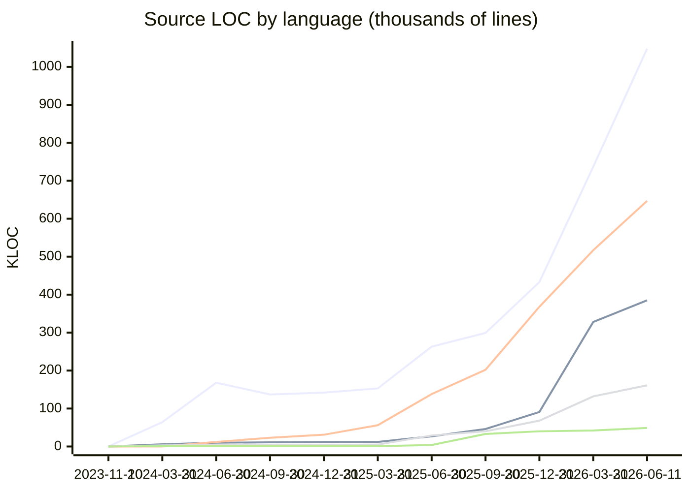

# Repository Stats

Lines-of-code snapshots over time, counted with [cloc](https://github.com/AlDanial/cloc) over git-tracked files
(`node_modules`, `dist`, and other ignored paths are excluded automatically).

To record a new snapshot:

```bash
node stats/repo-stats.mjs              # current tree
node stats/repo-stats.mjs <commit>     # backfill a historical commit
```

**Latest** (2026-06-11, `eb5840826c`): **2,289,419** source LOC · **11,934,754** total LOC · 13,745 files

## Source code over time

Lines in top-to-bottom legend order: **TypeScript, HTML, Markdown, CSS, JavaScript**.



## Source vs generated/data over time

Lines: **Source total (TS+JS+HTML+CSS+MD), SQL, JSON**. SQL is dominated by migrations
(including generated CodeGen runs); JSON is mostly declarative metadata.


## History

| Date | Commit | TypeScript | JavaScript | HTML | CSS | Markdown | Source Total | SQL | JSON | Other | Grand Total | Files |
|---|---|---:|---:|---:|---:|---:|---:|---:|---:|---:|---:|---:|
| [2023-11-10](reports/2023-11-10.md) | `ded939260c` | 0 | 0 | 1 | 0 | 27 | **28** | 0 | 0 | 0 | 28 | 2 |
| [2024-03-31](reports/2024-03-31.md) | `ddd43bf190` | 64,038 | 533 | 5,753 | 3,156 | 334 | **73,814** | 16,647 | 28,835 | 8,425 | 127,721 | 928 |
| [2024-06-30](reports/2024-06-30.md) | `008aed0251` | 167,864 | 658 | 10,397 | 4,179 | 11,593 | **194,691** | 190,984 | 86,111 | 910 | 472,696 | 1,475 |
| [2024-09-30](reports/2024-09-30.md) | `a5290aaeeb` | 137,332 | 748 | 11,472 | 4,185 | 22,586 | **176,323** | 253,193 | 144,755 | 913 | 575,184 | 1,662 |
| [2024-12-31](reports/2024-12-31.md) | `681e361c18` | 142,226 | 1,385 | 11,738 | 4,438 | 30,624 | **190,411** | 257,685 | 183,280 | 1,080 | 632,456 | 1,772 |
| [2025-03-31](reports/2025-03-31.md) | `2bfb39a6b3` | 152,757 | 1,386 | 12,270 | 4,596 | 55,668 | **226,677** | 282,370 | 256,894 | 1,153 | 767,094 | 1,883 |
| [2025-06-30](reports/2025-06-30.md) | `adee85788a` | 263,127 | 3,537 | 26,876 | 28,782 | 138,488 | **460,810** | 404,760 | 299,354 | 1,216 | 1,166,140 | 2,826 |
| [2025-09-30](reports/2025-09-30.md) | `3f71ef40a9` | 299,077 | 32,899 | 46,359 | 39,997 | 202,466 | **620,798** | 649,918 | 339,735 | 1,418 | 1,611,869 | 3,541 |
| [2025-12-31](reports/2025-12-31.md) | `fc0d67833f` | 432,542 | 40,442 | 91,124 | 67,869 | 367,894 | **999,871** | 1,165,550 | 1,572,071 | 2,134 | 3,739,626 | 5,214 |
| [2026-03-31](reports/2026-03-31.md) | `ada6e1a5d1` | 737,301 | 42,256 | 327,894 | 132,178 | 517,314 | **1,756,943** | 2,399,109 | 1,630,992 | 14,887 | 5,801,931 | 7,772 |
| [2026-06-11](reports/2026-06-11.md) | `eb5840826c` | 1,048,245 | 48,616 | 384,549 | 161,048 | 646,961 | **2,289,419** | 7,351,084 | 2,273,191 | 21,060 | 11,934,754 | 13,745 |

Full per-language breakdowns for each snapshot are in [reports/](reports/). Raw time series: [data.csv](data.csv).
