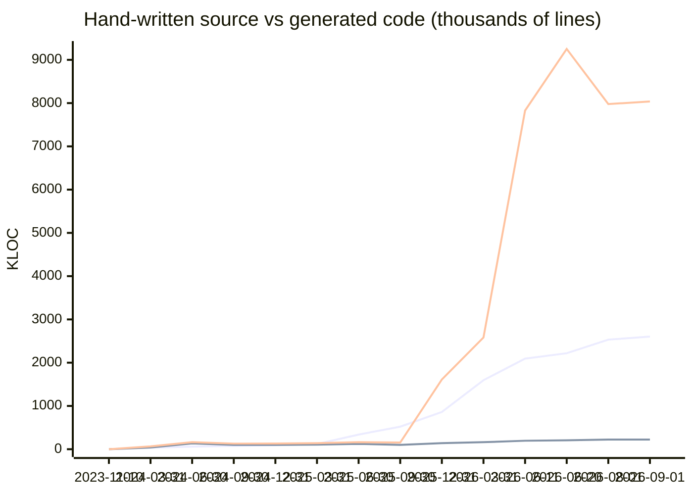
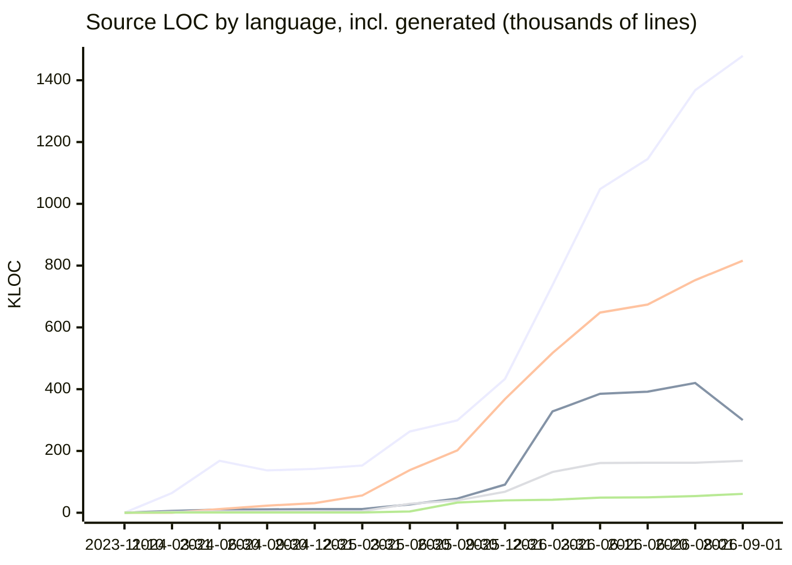
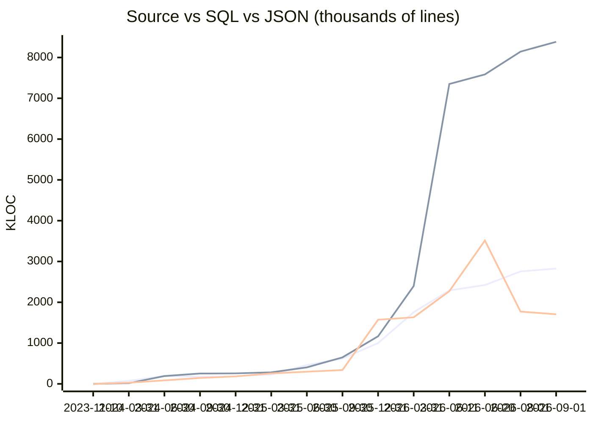

# Repository Stats

Lines-of-code snapshots over time, counted with [cloc](https://github.com/AlDanial/cloc) over git-tracked files
(`node_modules`, `dist`, and other ignored paths are excluded automatically). Every count is split into
**hand-written** vs **generated** — deterministic tool output such as CodeGen entity classes/forms/resolvers,
`mj codegen manifest` registrations, mj-sync metadata migrations, baseline consolidations, pg-migrate
conversions, connector metadata, and lockfiles. The exact patterns live in [repo-stats.mjs](repo-stats.mjs).

To record a new snapshot (or use the `/update-stats` Claude command, which adds narrative analysis):

```bash
node stats/repo-stats.mjs              # current tree
node stats/repo-stats.mjs <commit>     # backfill a historical commit
node stats/repo-stats.mjs --render     # re-render README from data.csv (no recount)
```

**Latest** (2026-09-01, `1e6c435341`): **2,602,482** hand-written source LOC · 2,824,563 source incl. generated · **12,984,015** total LOC (62% generated) · 18,437 files

## Latest analysis (2026-09-01)

Hand-written source (TS+JS+HTML+CSS+MD) grew from 2,532,735 to 2,602,482 lines (+2.8%) over
the month since 2026-08-01, a net figure that hides two much larger offsetting moves. TypeScript
hand-written code grew by 114,439 lines while HTML hand-written code *shrank* by 121,220 —
almost a wash at the source-group level, but for entirely different reasons.

The HTML drop is a single deletion, not a trend: `packages/Integration/connectors/reference/ym-api-reference.html`
(146,904 lines) was removed in PR #3385, "chore: remove connector source duplicated by the
Integrations repo." That file was a vendored API reference doc that had been inflating the HTML
bucket for a while; connector source of truth now lives in the separate Integrations repo. The
TypeScript growth is real feature work spread across ~250 merged PRs this cycle — the TaskGraph
system (`TaskGraphDispatcher`, `TaskGraphService`, `TaskClaimStore`, phases 0–2 of its legacy
retirement and truthful-engine work), a cluster of Integration-engine reliability PRs (adaptive
fetch gating, prefetch pipelining/concurrency, per-entity write chains, batched-write flush
ceiling, RSU retry budget), the Workflows canvas and human-in-the-loop editor, realtime/ElevenLabs
voice-session hardening, and new Angular components (hierarchy-tree, graph-view, form-chrome
layering, record-attachments).

SQL grew by 240,009 lines (105,114 hand-written, 134,895 generated), reflecting the steady v6.1
migration cadence: AI Agent Harness Foundation, the TaskGraph payload/claim-column and
skipped/exclusive-group migrations, Durable EntityAction Dispatch, Query Entity Materialization,
a hierarchy-views/FormChromeRule regeneration, and several rounds of `Metadata_Sync` migrations
(each paired with its PostgreSQL mirror under `migrations-pg/`). Markdown hand-written content grew
63k lines, split between planning docs under `plans/` (memory-leak audit, TaskGraph/flow-agent
unification, conversation-detail windowing, API-key row filters) and per-package `CHANGELOG.md`
files generated by the changesets release tooling.

The "Other"/YAML bucket jumped 45,026 lines, almost entirely `pnpm-lock.yaml` (+49,302), the
lockfile produced by PR #3466's npm→pnpm cutover. This looks like a classification gap:
`GENERATED_PATTERNS` already treats `package-lock.json` as tool-emitted output, but the repo's
new `pnpm-lock.yaml` isn't covered by any pattern, so this month's entire cutover reads as
"hand-written." Worth adding a `pnpm-lock.yaml` pattern (and backfilling) so lockfile churn stops
distorting the hand-written trend going forward. The two large `generated/` TypeScript files
(`MJCoreEntities/.../entities/__mj.ts`, `MJServer/.../graphql-schemas/__mj.ts`) each show ~100k+
lines of raw diff churn but net out close to flat — a full CodeGen regeneration during the v6.1
cycle rewrote them rather than growing them.

## Hand-written vs generated over time

Lines in top-to-bottom legend order: **hand-written source (TS+JS+HTML+CSS+MD), generated source, all generated code (every language)**.


```mermaid
xychart-beta
    title "Hand-written source vs generated code (thousands of lines)"
    x-axis ["2023-11-10", "2024-03-31", "2024-06-30", "2024-09-30", "2024-12-31", "2025-03-31", "2025-06-30", "2025-09-30", "2025-12-31", "2026-03-31", "2026-06-11", "2026-06-20", "2026-08-01", "2026-09-01"]
    y-axis "KLOC"
    line [0, 34, 60, 77, 91, 121, 338, 521, 860, 1595, 2094, 2218, 2533, 2602]
    line [0, 40, 135, 99, 100, 105, 123, 100, 140, 162, 196, 205, 224, 222]
    line [0, 65, 162, 130, 131, 141, 162, 154, 1611, 2582, 7828, 9252, 7977, 8037]
```

## Source code over time

Lines in top-to-bottom legend order: **TypeScript, HTML, Markdown, CSS, JavaScript** (totals incl. generated).


```mermaid
xychart-beta
    title "Source LOC by language, incl. generated (thousands of lines)"
    x-axis ["2023-11-10", "2024-03-31", "2024-06-30", "2024-09-30", "2024-12-31", "2025-03-31", "2025-06-30", "2025-09-30", "2025-12-31", "2026-03-31", "2026-06-11", "2026-06-20", "2026-08-01", "2026-09-01"]
    y-axis "KLOC"
    line [0, 64, 168, 137, 142, 153, 263, 299, 433, 737, 1048, 1145, 1368, 1479]
    line [0, 6, 10, 11, 12, 12, 27, 46, 91, 328, 385, 392, 420, 300]
    line [0, 0, 12, 23, 31, 56, 138, 202, 368, 517, 648, 674, 753, 816]
    line [0, 3, 4, 4, 4, 5, 29, 40, 68, 132, 161, 162, 162, 168]
    line [0, 1, 1, 1, 1, 1, 4, 33, 40, 42, 49, 50, 54, 61]
```

## Source vs generated/data over time

Lines: **Source total (TS+JS+HTML+CSS+MD), SQL, JSON**. SQL is dominated by tool-emitted migrations;
JSON is mostly declarative metadata and committed tool outputs.


```mermaid
xychart-beta
    title "Source vs SQL vs JSON (thousands of lines)"
    x-axis ["2023-11-10", "2024-03-31", "2024-06-30", "2024-09-30", "2024-12-31", "2025-03-31", "2025-06-30", "2025-09-30", "2025-12-31", "2026-03-31", "2026-06-11", "2026-06-20", "2026-08-01", "2026-09-01"]
    y-axis "KLOC"
    line [0, 74, 195, 176, 190, 227, 461, 621, 1000, 1757, 2291, 2423, 2757, 2825]
    line [0, 17, 191, 253, 258, 282, 405, 650, 1166, 2399, 7351, 7586, 8144, 8384]
    line [0, 29, 86, 145, 183, 257, 299, 340, 1572, 1631, 2273, 3514, 1772, 1705]
```

## History

Per-language cells show total LOC with the generated share in parentheses. **Hand Source** = source LOC minus generated.

| Date | Commit | TypeScript | JavaScript | HTML | CSS | Markdown | Hand Source | SQL | JSON | Grand Total | Files |
|---|---|---:|---:|---:|---:|---:|---:|---:|---:|---:|---:|
| [2023-11-10](reports/2023-11-10.md) · [analysis](analysis/2023-11-10.md) | `ded939260c` | 0 | 0 | 1 | 0 | 27 | **28** | 0 | 0 | 28 | 2 |
| [2024-03-31](reports/2024-03-31.md) · [analysis](analysis/2024-03-31.md) | `ddd43bf190` | 64,038 (57%) | 533 | 5,753 (52%) | 3,156 | 334 | **34,294** | 16,647 | 28,835 (87%) | 127,721 | 928 |
| [2024-06-30](reports/2024-06-30.md) · [analysis](analysis/2024-06-30.md) | `008aed0251` | 167,864 (76%) | 658 | 10,397 (65%) | 4,179 | 11,593 | **59,565** | 190,984 | 86,111 (32%) | 472,696 | 1,475 |
| [2024-09-30](reports/2024-09-30.md) · [analysis](analysis/2024-09-30.md) | `a5290aaeeb` | 137,332 (67%) | 748 | 11,472 (68%) | 4,185 | 22,586 | **77,139** | 253,193 | 144,755 (22%) | 575,184 | 1,662 |
| [2024-12-31](reports/2024-12-31.md) · [analysis](analysis/2024-12-31.md) | `681e361c18` | 142,226 (65%) | 1,385 | 11,738 (64%) | 4,438 | 30,624 | **90,587** | 257,685 | 183,280 (17%) | 632,456 | 1,772 |
| [2025-03-31](reports/2025-03-31.md) · [analysis](analysis/2025-03-31.md) | `2bfb39a6b3` | 152,757 (64%) | 1,386 | 12,270 (64%) | 4,596 | 55,668 | **121,284** | 282,370 | 256,894 (14%) | 767,094 | 1,883 |
| [2025-06-30](reports/2025-06-30.md) · [analysis](analysis/2025-06-30.md) | `adee85788a` | 263,127 (43%) | 3,537 | 26,876 (34%) | 28,782 (1%) | 138,488 | **338,096** | 404,760 | 299,354 (13%) | 1,166,140 | 2,826 |
| [2025-09-30](reports/2025-09-30.md) · [analysis](analysis/2025-09-30.md) | `3f71ef40a9` | 299,077 (30%) | 32,899 | 46,359 (18%) | 39,997 (1%) | 202,466 | **521,292** | 649,918 | 339,735 (16%) | 1,611,869 | 3,541 |
| [2025-12-31](reports/2025-12-31.md) · [analysis](analysis/2025-12-31.md) | `fc0d67833f` | 432,542 (19%) | 40,442 | 91,124 (45%) | 67,869 | 367,894 (4%) | **860,252** | 1,165,550 (22%) | 1,572,071 (77%) | 3,739,626 | 5,214 |
| [2026-03-31](reports/2026-03-31.md) · [analysis](analysis/2026-03-31.md) | `ada6e1a5d1` | 737,301 (14%) | 42,256 | 327,894 (15%) | 132,178 | 517,314 (3%) | **1,594,996** | 2,399,109 (49%) | 1,630,992 (76%) | 5,801,931 | 7,772 |
| [2026-06-11](reports/2026-06-11.md) · [analysis](analysis/2026-06-11.md) | `ade23a0282` | 1,048,378 (12%) | 48,944 | 384,574 (15%) | 161,048 | 647,634 (2%) | **2,094,406** | 7,351,084 (80%) | 2,273,191 (78%) | 11,935,925 | 13,760 |
| [2026-06-20](reports/2026-06-20.md) · [analysis](analysis/2026-06-20.md) | `77f7a12456` | 1,145,187 (11%) | 50,223 | 391,642 (16%) | 162,430 | 673,879 (2%) | **2,218,083** | 7,586,164 (80%) | 3,514,176 (85%) | 13,546,105 | 14,646 |
| [2026-08-01](reports/2026-08-01.md) · [analysis](analysis/2026-08-01.md) | `d5140516d7` | 1,368,270 (10%) | 53,962 | 419,850 (16%) | 161,762 | 753,147 (2%) | **2,532,735** | 8,143,823 (80%) | 1,771,552 (70%) | 12,698,260 | 16,917 |
| [2026-09-01](reports/2026-09-01.md) · [analysis](analysis/2026-09-01.md) | `1e6c435341` | 1,478,677 (9%) | 61,021 | 300,419 (23%) | 168,294 | 816,152 (2%) | **2,602,482** | 8,383,832 (79%) | 1,704,700 (69%) | 12,984,015 | 18,437 |

Full per-language breakdowns and snapshot-over-snapshot deltas are in [reports/](reports/);
narrative analyses in [analysis/](analysis/). Raw time series: [data.csv](data.csv).
