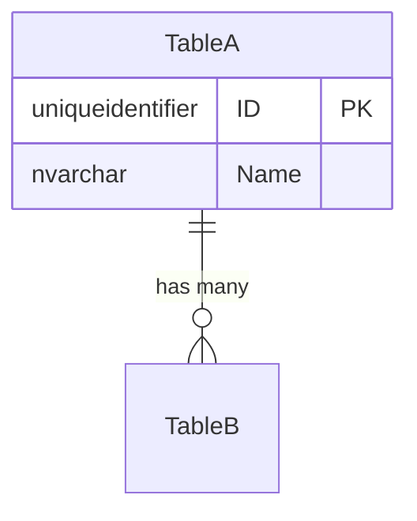
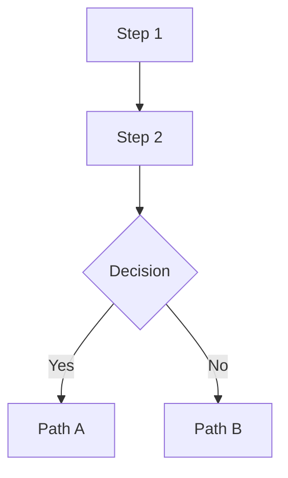

# Save Plan & Open PR

Capture the current conversation's design/implementation plan as a detailed markdown file, commit it to a **brand-new worktree + branch**, push the branch, and open a PR — all without modifying the user's current working tree or local branch in any way.

---

## Pre-flight

1. **Record the current working directory** (`$ORIG_DIR`) and **current branch** (`$ORIG_BRANCH`) for reference. You will **never** switch branches or modify files in `$ORIG_DIR`.

2. **Determine the user prefix** for the branch name:
   - If `$ARGUMENTS` includes a branch-prefix, use it.
   - Otherwise, derive from `git config user.name`: lowercase, replace spaces with hyphens (e.g. `Amith Nagarajan` -> `amith-nagarajan`).

3. **Compute names**:
   - `$PLAN_NAME` = the `plan-name` argument (kebab-case).
   - `$BRANCH` = `<user-prefix>/<plan-name>` (e.g. `amith-nagarajan/dashboard-permissions`).
   - `$PLAN_FILE` = `plans/<plan-name>.md`.

4. **Check for conflicts**:
   - If a local branch named `$BRANCH` already exists, **stop** and ask the user for a different name.
   - If `plans/<plan-name>.md` already exists on the `next` branch, **warn** the user and ask whether to overwrite or pick a new name.

---

## Step 1 — Create a new git worktree

```bash
# Create the worktree directory under .claude/worktrees/ (gitignored)
git worktree add .claude/worktrees/$PLAN_NAME -b $BRANCH next
```

- The worktree is based on the `next` branch (the repo's main integration branch).
- This creates a **completely isolated** working directory at `.claude/worktrees/$PLAN_NAME/`.
- **CRITICAL**: Do NOT use `EnterWorktree` / `ExitWorktree` tools. Do NOT use any existing worktree. Create a fresh one with `git worktree add` as shown above.
- **CRITICAL**: All file writes and git commands from this point forward MUST target the worktree path (`.claude/worktrees/$PLAN_NAME/`), NEVER the original repo directory.

---

## Step 2 — Write the plan file

Create `plans/<plan-name>.md` **inside the worktree directory** (i.e. `.claude/worktrees/$PLAN_NAME/plans/<plan-name>.md`).

### Plan file structure

The plan must be **comprehensive enough for a developer (human or AI) who has zero context from this conversation** to fully implement the solution. Use this structure:

```markdown
# <Plan Title>

## Status
- **Status**: Draft
- **Created**: <YYYY-MM-DD>
- **Author**: <git user.name> + Claude
- **Branch**: <$BRANCH>

## Overview
<2-3 paragraph executive summary: what problem this solves, why it matters, and the high-level approach.>

## Goals & Non-Goals

### Goals
- <Concrete, measurable goal 1>
- <Goal 2>

### Non-Goals
- <Explicitly out of scope item 1>

## Background & Context
<Relevant context a new developer needs. Reference specific files, entities, existing patterns. Include links to related issues/PRs if discussed.>

## Architecture / Design

### Data Model Changes
<If any database changes are needed, describe tables, columns, relationships.>



### Component / Flow Design
<Describe the key components, services, classes involved and how they interact.>



### API Changes
<If applicable: new endpoints, GraphQL mutations, Action definitions, etc.>

## Implementation Plan

### Phase 1: <Phase Name>
1. **<Task 1>** — <Detailed description including specific file paths, function names, and what to change>
2. **<Task 2>** — <Description>

### Phase 2: <Phase Name>
1. **<Task 1>** — <Description>

<Add as many phases as needed. Each task should be specific enough to act on without further clarification.>

## Migration & Data

<If database migrations are needed, describe them in detail. Include:>
- Table/column changes
- Seed data requirements
- Migration ordering considerations
- CodeGen implications

## Testing Strategy

- <What to test and how>
- <Edge cases to cover>
- <Integration test considerations>

## Risks & Open Questions

- <Risk 1 and mitigation>
- <Open question that needs resolution during implementation>

## Files to Modify

| File | Change |
|------|--------|
| `path/to/file.ts` | Brief description of change |

## References

- <Links to related PRs, issues, docs, or conversations>
```

### Content guidelines

- **Be specific**: Reference actual file paths, class names, method names, entity names from the codebase.
- **Include code snippets** where they clarify the approach (TypeScript, SQL, HTML templates).
- **Use Mermaid diagrams** for:
  - ERD diagrams when data model changes are involved
  - Flowcharts for complex logic flows
  - Sequence diagrams for multi-component interactions
- **Include migration SQL** snippets if database changes are discussed.
- **List every file** that will need modification, not just the main ones.
- The plan should make someone who reads it say "I can start coding right now" — not "I need to ask more questions."

---

## Step 3 — Commit and push

All commands run inside the worktree directory:

```bash
cd .claude/worktrees/$PLAN_NAME

# Ensure the plans/ directory exists
mkdir -p plans

# Stage the plan file
git add plans/<plan-name>.md

# Commit
git commit -m "$(cat <<'EOF'
Add implementation plan: <plan-name>

<1-2 sentence summary of what the plan covers>

Co-Authored-By: Claude Opus 4.6 (1M context) <noreply@anthropic.com>
EOF
)"

# Push and set upstream tracking to the SAME branch name
git push -u origin $BRANCH
```

**CRITICAL**: Verify tracking after push:
```bash
git branch -vv
```
The branch MUST track `origin/$BRANCH`, NOT `origin/next`.

---

## Step 4 — Create the PR

```bash
cd .claude/worktrees/$PLAN_NAME

gh pr create --base next --title "Plan: <Human-readable plan title>" --body "$(cat <<'EOF'
## Plan: <Plan Title>

This PR contains an implementation plan for review before coding begins.

### Summary
- <Key point 1 from the plan>
- <Key point 2>
- <Key point 3>

### How to review
1. Read `plans/<plan-name>.md` for the full plan
2. Comment on any design decisions you disagree with
3. Approve when ready for implementation to begin

### Labels
This is a **plan-only PR** — no code changes are included.

Generated with [Claude Code](https://claude.com/claude-code)
EOF
)"
```

---

## Step 5 — Clean up and report

1. **Remove the worktree** (the branch persists on the remote):
   ```bash
   cd $ORIG_DIR
   git worktree remove .claude/worktrees/$PLAN_NAME
   ```

2. **Verify** we are back in `$ORIG_DIR` on `$ORIG_BRANCH` and nothing has changed:
   ```bash
   git status
   git branch --show-current
   ```

3. **Report to the user**:
   - The PR URL (clickable)
   - The branch name
   - A direct link to view the plan file on GitHub: `https://github.com/<owner>/<repo>/blob/$BRANCH/plans/<plan-name>.md`
   - Confirmation that no local changes were made

---

## Safety Rules

- **NEVER** modify, stage, commit, or checkout anything in the user's current working tree (`$ORIG_DIR`).
- **NEVER** switch branches in the main repo. All work happens in the worktree.
- **NEVER** use `EnterWorktree` or `ExitWorktree` tools — use raw `git worktree add/remove` commands.
- **NEVER** reuse an existing worktree — always create a fresh one.
- **NEVER** force-push.
- **NEVER** delete remote branches.
- If any step fails, **clean up the worktree** before reporting the error:
  ```bash
  cd $ORIG_DIR
  git worktree remove --force .claude/worktrees/$PLAN_NAME 2>/dev/null
  git branch -d $BRANCH 2>/dev/null
  ```
- After completion, `git status` in `$ORIG_DIR` must show the exact same output as before the command ran.
